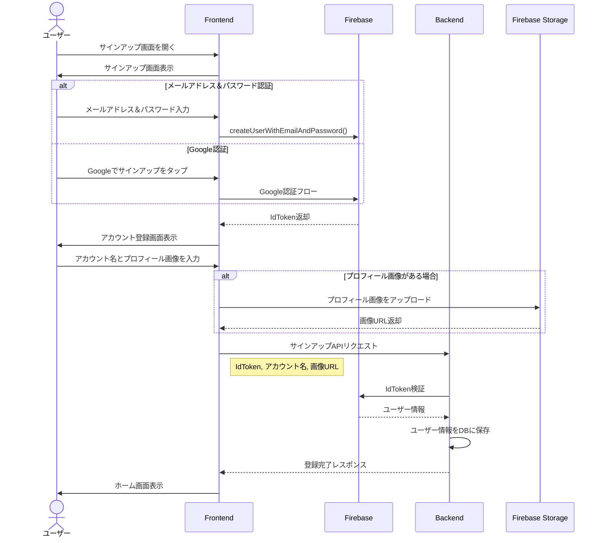

# 認証フロー

このドキュメントでは、Kaimonアプリケーションの認証フローについて説明します。

## サインアップ（会員登録）フロー

```mermaid
sequenceDiagram
    actor User as ユーザー
    participant Frontend
    participant Firebase
    participant Backend
    participant Storage as Firebase Storage
    
    User->>Frontend: サインアップ画面を開く
    Frontend->>User: サインアップ画面表示
    
    alt メールアドレス＆パスワード認証
        User->>Frontend: メールアドレス＆パスワード入力
        Frontend->>Firebase: createUserWithEmailAndPassword()
    else Google認証
        User->>Frontend: Googleでサインアップをタップ
        Frontend->>Firebase: Google認証フロー
    end
    
    Firebase-->>Frontend: IdToken返却
    
    Frontend->>User: アカウント登録画面表示
    User->>Frontend: アカウント名とプロフィール画像を入力
    
    alt プロフィール画像がある場合
        Frontend->>Storage: プロフィール画像をアップロード
        Storage-->>Frontend: 画像URL返却
    end
    
    Frontend->>Backend: サインアップAPIリクエスト
    note right of Frontend: IdToken, アカウント名, 画像URL
    
    Backend->>Firebase: IdToken検証
    Firebase-->>Backend: ユーザー情報
    
    Backend->>Backend: ユーザー情報をDBに保存
    Backend-->>Frontend: 登録完了レスポンス
    
    Frontend->>User: ホーム画面表示
```
