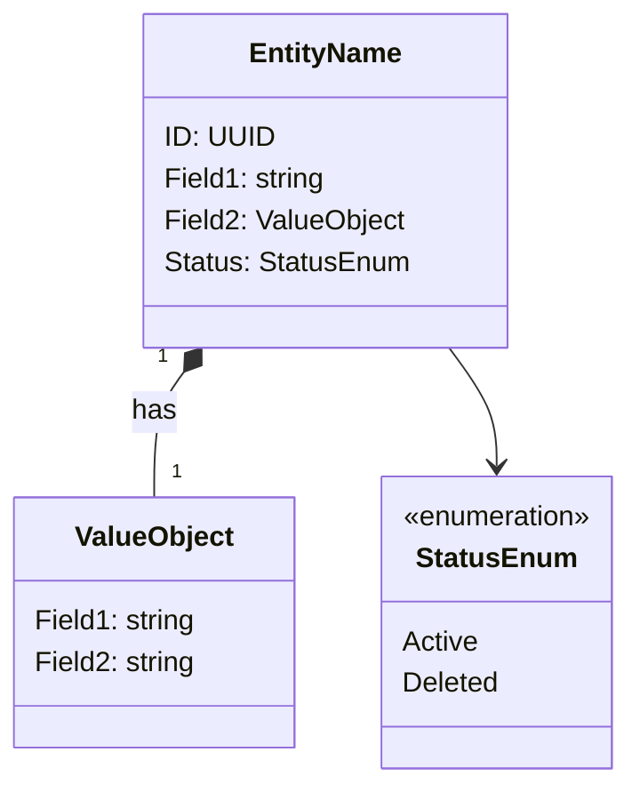

# {ドメイン名} - ドメインモデル

## モデル図

## 集約

### {集約名}（{English Name} Aggregate）

| 要素 | 種別 | 集約ルート |
|------|------|----------|
| {エンティティ名} | エンティティ | Yes |
| {値オブジェクト名} | 値オブジェクト | - |

{集約の操作ルールを記載する}

### 他集約からの参照（IDのみ）

{他ドメインからどのIDで参照されるか記載する}

## 対訳表（ユビキタス言語）

{日本語とコード上の英語名の対応を記載する。コード実装時の命名根拠になる}

| 日本語 | 英語（コード） | 備考 |
|--------|-------------|------|
| {日本語名} | {EnglishName} | {役割・補足} |
