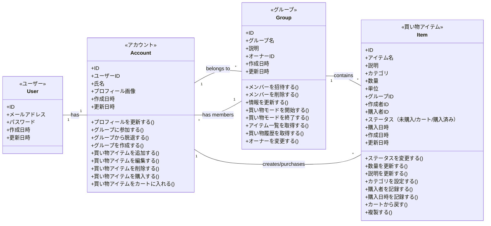

# ドメインモデル図

このドキュメントはShare Basketアプリケーションのドメインモデルを示しています。

## エンティティと関連

## 追加コンテキスト

### ユーザー (User)
- 認証に関する情報を保持する
- メールアドレスとパスワードでの認証情報を管理
- アカウントと1対1で紐づく

### アカウント (Account)
- サービス利用に必要な情報を保持する
- ユーザープロフィール情報を管理
- 複数のグループに所属可能
- アイテムを作成したり購入したりする

**振る舞い：**
- プロフィールを更新する：ユーザー名や画像などのプロフィール情報を変更
- グループに参加する：招待されたグループに参加
- グループから脱退する：所属しているグループを脱退
- グループを作成する：新しいグループを作成し、オーナーになる
- 買い物アイテムを追加する：グループに新しい買い物アイテムを追加
- 買い物アイテムを編集する：既存のアイテム情報を変更
- 買い物アイテムを削除する：不要なアイテムを削除
- 買い物アイテムを購入する：アイテムのステータスを「購入済み」に変更
- 買い物アイテムをカートに入れる：アイテムのステータスを「カート」に変更

### グループ (Group)
- 家族やイベントなどの買い物を共有するユニット
- 所有者（作成者）が存在する
- 複数のメンバー（アカウント）を持つ
- 複数の買い物アイテムを持つ

**振る舞い：**
- メンバーを招待する：新しいメンバーをグループに招待
- メンバーを削除する：既存のメンバーをグループから削除
- 情報を更新する：グループ名や説明などの情報を変更
- 買い物モードを開始する：リアルタイム共有の買い物モードを開始
- 買い物モードを終了する：買い物モードを終了し、結果を保存
- アイテム一覧を取得する：グループ内のすべての買い物アイテムを取得
- 買い物履歴を取得する：過去の購入履歴を確認
- オーナーを変更する：グループのオーナー権限を別のメンバーに譲渡

### 買い物アイテム (Item)
- 買うべき商品を表す
- 名前、説明、カテゴリ、数量、単位などの情報を持つ
- 特定のグループに属する
- 作成者が存在する
- ステータスを持つ（未購入/カート/購入済み）
- 購入者や購入日時などの情報を持つ

**振る舞い：**
- ステータスを変更する：未購入/カート/購入済みの状態を変更
- 数量を更新する：購入すべき数量を変更
- 説明を更新する：詳細情報を追加・変更
- カテゴリを設定する：アイテムのカテゴリを分類
- 購入者を記録する：誰が購入したかを記録
- 購入日時を記録する：いつ購入されたかを記録
- カートから戻す：カート状態から未購入状態に戻す
- 複製する：同じ情報を持つ新しいアイテムを作成 