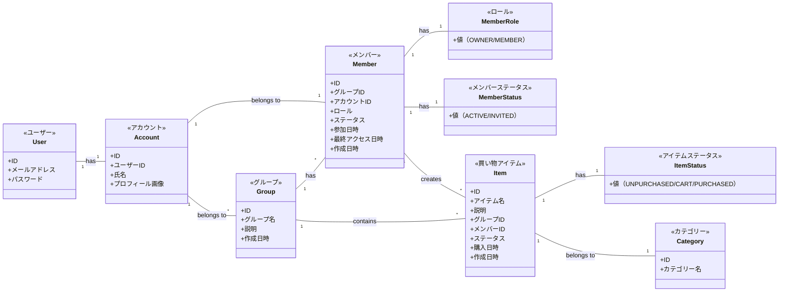

# ドメインモデル図

このドキュメントはShare Basketアプリケーションのドメインモデルを示しています。

## エンティティと関連

## 追加コンテキスト

### ユーザー (User)
- 認証に関する情報を保持する
- メールアドレスとパスワードでの認証情報を管理
- アカウントと1対1で紐づく

### アカウント (Account)
- サービス利用に必要な情報を保持する
- ユーザープロフィール情報を管理
- 複数のグループに所属可能（Member経由）
- グループへの招待を受け取り、応答する

### グループ (Group)
- 家族やイベントなどの買い物を共有するユニット
- 所有者（作成者）が存在する（Memberエンティティのロールで管理）
- 複数のメンバーを持つ
- 複数の買い物アイテムを持つ

### メンバー (Member)
- グループとアカウントの間の関連を表現する
- グループ内でのアカウントの役割や状態を管理する
- メンバーロールとメンバーステータスを値オブジェクトとして持つ
- 参加日時や最終アクセス日時などの情報を管理する

### メンバーロール (MemberRole)
- メンバーの役割を表す値オブジェクト
- OWNER（オーナー）とMEMBER（メンバー）の2種類の値を持つ

### メンバーステータス (MemberStatus)
- メンバーの状態を表す値オブジェクト
- ACTIVE（アクティブ）とINVITED（招待中）の2種類の値を持つ

### 買い物アイテム (Item)
- 買うべき商品を表す
- 名前、説明などの情報を持つ（数量や単位は説明に含める）
- 特定のグループに属する
- 特定のカテゴリーに属する
- 作成したメンバーと紐づく
- ステータスを値オブジェクトとして持つ
- 購入日時の情報を持つ

### アイテムステータス (ItemStatus)
- 買い物アイテムの状態を表す値オブジェクト
- UNPURCHASED（未購入）、CART（カート）、PURCHASED（購入済み）の3種類の値を持つ

### カテゴリー (Category)
- 買い物アイテムを分類するためのエンティティ
- システムであらかじめ定義されたカテゴリー一覧から選択する
- カテゴリー名を持つ
- 買い物アイテムは必ず1つのカテゴリーに属する 