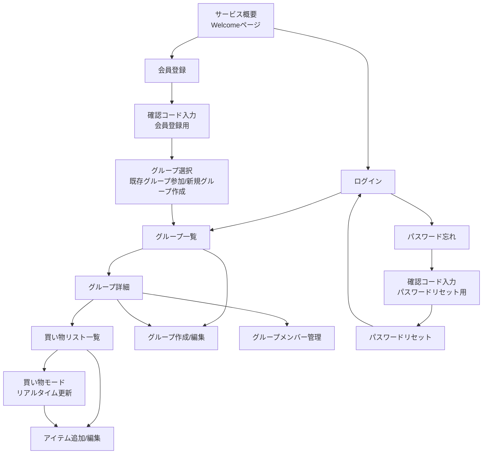

# 画面遷移図

このドキュメントはアプリケーションの画面遷移を示しています。

## 画面一覧

- サービス概要（Welcomeページ）
- ログイン
- 会員登録
- 確認コード入力（会員登録用）
- グループ選択（既存グループ参加/新規グループ作成）
- グループ一覧
- グループ詳細
- 買い物リスト一覧
- 買い物モード（リアルタイム更新）
- アイテム追加/編集
- グループ作成/編集
- グループメンバー管理
- パスワード忘れ
- 確認コード入力（パスワードリセット用）
- パスワードリセット

## 遷移図

