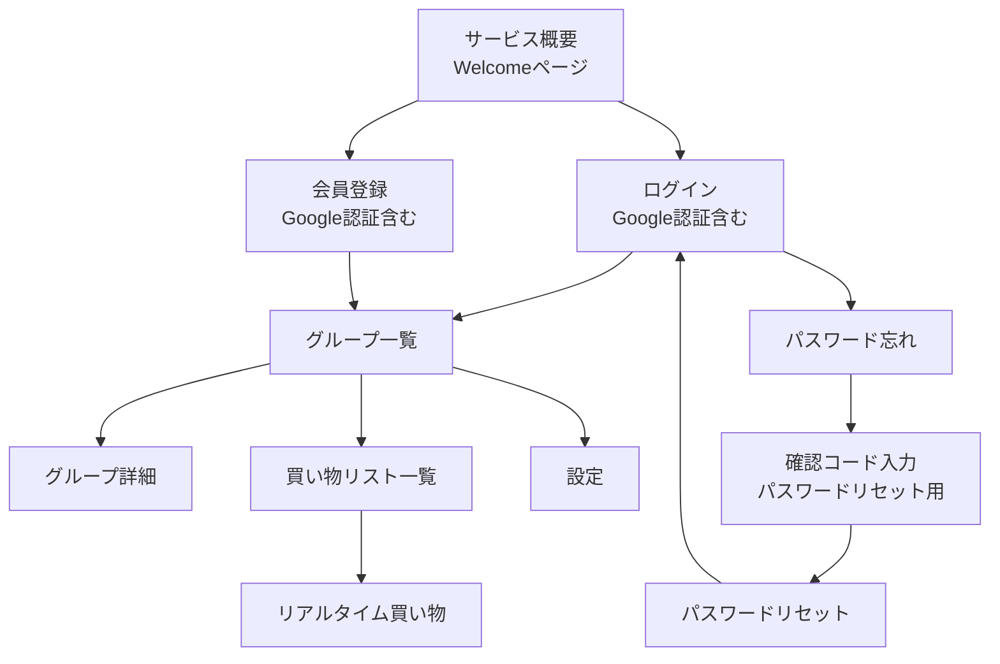

# 画面遷移図

このドキュメントはアプリケーションの画面遷移を示しています。

## 画面一覧

- サービス概要（Welcomeページ）
- ログイン（Google認証含む）
- 会員登録（Google認証含む）
- グループ一覧
- グループ詳細
- 買い物リスト一覧
- リアルタイム買い物
- 設定
- パスワード忘れ
- 確認コード入力（パスワードリセット用）
- パスワードリセット

## 遷移図

