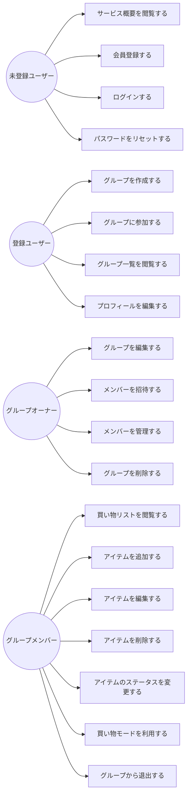

# ユースケース図

このドキュメントはShare Basketアプリケーションのユースケースを示しています。

## 主要アクター

- 未登録ユーザー
- 登録ユーザー
- グループオーナー
- グループメンバー

## ユースケース図

## ユースケース詳細

### 未登録ユーザー

1. **サービス概要を閲覧する**
   - Welcomeページでサービスの機能や特徴を確認できる

2. **会員登録する**
   - メールアドレスとパスワードで新規アカウントを作成する
   - 確認コードを入力して登録を完了する

3. **ログインする**
   - 登録済みのメールアドレスとパスワードでログインする

4. **パスワードをリセットする**
   - パスワード忘れの場合に再設定を行う
   - 確認コードを入力してパスワードリセットを完了する

### 登録ユーザー

5. **グループを作成する**
   - 新しい買い物共有グループを作成する
   - グループ名や説明を設定する

6. **グループに参加する**
   - 招待されたグループに参加する

7. **グループ一覧を閲覧する**
   - 所属している全てのグループを確認する

8. **プロフィールを編集する**
   - 氏名やプロフィール画像などの個人情報を更新する

### グループオーナー

9. **グループを編集する**
   - グループ名や説明を変更する

10. **メンバーを招待する**
    - 新しいメンバーをグループに招待する

11. **メンバーを管理する**
    - メンバーのロールや権限を変更する
    - メンバーをグループから削除する

12. **グループを削除する**
    - 不要になったグループを削除する

### グループメンバー

13. **買い物リストを閲覧する**
    - グループの買い物リスト一覧を確認する

14. **アイテムを追加する**
    - 買い物リストに新しいアイテムを追加する
    - カテゴリーを選択する

15. **アイテムを編集する**
    - 既存アイテムの詳細を変更する

16. **アイテムを削除する**
    - 不要なアイテムを削除する

17. **アイテムのステータスを変更する**
    - アイテムの状態を未購入/カート/購入済みに変更する

18. **買い物モードを利用する**
    - リアルタイムで更新される買い物モードでショッピングを行う

19. **グループから退出する**
    - 所属しているグループから退出する 